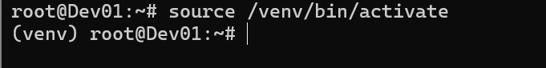
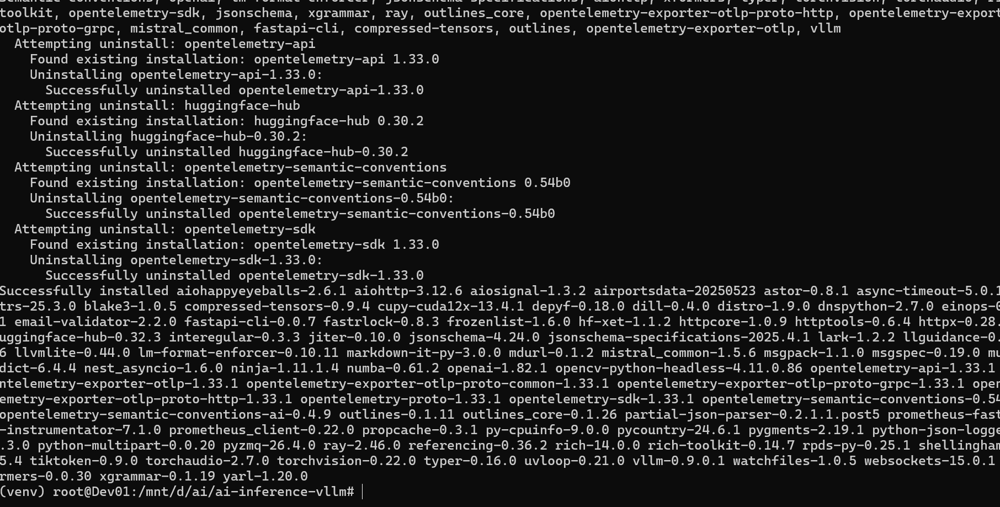
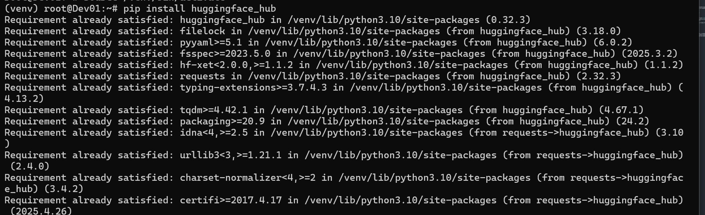
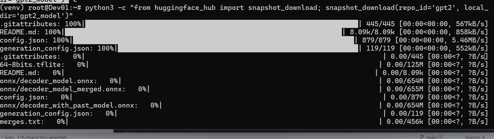
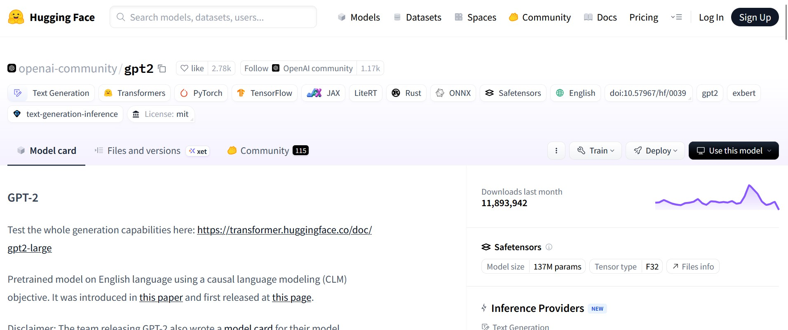

# vLLM Inference Server Installation and Usage Guide

**vLLM** is a high-performance inference library for Large Language Models (LLMs). Its strength lies in utilizing advanced techniques such as **PagedAttention** for efficient memory management, **Continuous Batching**, and custom **CUDA Kernels**. These features make vLLM an excellent choice for LLM applications demanding high speed and efficiency.


## Table of Contnent
 * [vLLM Inference Server Installation and Usage Guide](https://github.com/dendie-sanjaya/ai-inference-vllm/%23vllm-inference-server-installation-and-usage-guide)
      * [1. Environment Preparation](https://github.com/dendie-sanjaya/ai-inference-vllm/%231-environment-preparation)
          * [Python Installation](https://github.com/dendie-sanjaya/ai-inference-vllm/%23python-installation)
          * [CUDA Toolkit Installation (For NVIDIA GPU Users)](https://github.com/dendie-sanjaya/ai-inference-vllm/%23cuda-toolkit-installation-for-nvidia-gpu-users)
          * [Creating a Python Virtual Environment](https://github.com/dendie-sanjaya/ai-inference-vllm/creating-a-python-virtual-environment)
      * [2. vLLM Installation](https://github.com/dendie-sanjaya/ai-inference-vllm/%232-vllm-installation)
      * [3. Downloading a Model (Optional)](https://www.google.com/search?q=%233-downloading-a-model-optional)
          * [Understanding Hugging Face Model File Structure](https://github.com/dendie-sanjaya/ai-inference-vllm/%23understanding-hugging-face-model-file-structure)
      * [4. Running the vLLM Inference Server](https://github.com/dendie-sanjaya/ai-inference-vllm/%234-running-the-vllm-inference-server)
      * [5. Interacting with the vLLM Server](https://github.com/dendie-sanjaya/ai-inference-vllm/%235-interacting-with-the-vllm-server)
          * [Using `curl` (from the terminal)](https://github.com/dendie-sanjaya/ai-inference-vllm/%23using-curl-from-the-terminal)
          * [Using a Python Script (for more programmatic control)](https://github.com/dendie-sanjaya/ai-inference-vllm/%23using-a-python-script-for-more-programmatic-control)


## 1\. Environment Preparation

### Python Installation

vLLM requires **Python 3.9 or higher**. To install it on Ubuntu/WSL, use the following commands:

```bash
sudo apt update
sudo apt install python3.9 python3.9-venv python3-pip -y
```

### CUDA Toolkit Installation (For NVIDIA GPU Users)

If you have an NVIDIA GPU and want to leverage its acceleration (highly recommended for optimal vLLM performance), you need to install the CUDA Toolkit within your WSL environment.

**Example Installation (commands may vary, always check NVIDIA's official documentation):**

```bash
wget https://developer.download.nvidia.com/compute/cuda/repos/wsl-ubuntu/x86_64/cuda-wsl-ubuntu.pin
sudo mv cuda-wsl-ubuntu.pin /etc/apt/preferences.d/cuda-repository-pin
wget https://developer.download.nvidia.com/compute/cuda/repos/wsl-ubuntu/x86_64/cuda-wsl-ubuntu.deb
sudo dpkg -i cuda-wsl-ubuntu.deb
sudo apt-key adv --fetch-keys https://developer.download.nvidia.com/compute/cuda/repos/wsl-ubuntu/x86_64/3bf863cc.pub
sudo apt update
sudo apt install cuda -y
```

**Verify CUDA Installation:**

```bash
nvcc --version
nvidia-smi
```

### Creating a Python Virtual Environment

It's highly recommended to use a virtual environment (venv) to isolate your project dependencies.

```bash
python3 -m venv 
source /venv/bin/activate # Activate the virtual environment
```



## 2\. vLLM Installation

Install vLLM using pip:

```bash
pip install vllm
```




## 3\. Downloading a Model (Optional)

vLLM will automatically download the model from Hugging Face if it's not present locally. However, if you want to pre-download the model or use a specific local path, you can use the `huggingface_hub` library.

Examples of models that can be used: [gpt2](https://huggingface.co/openai-community/gpt2) 

```bash
pip install huggingface_hub
```



**To download the GPT-2 model:**

```bash
python3 -c "from huggingface_hub import snapshot_download; snapshot_download(repo_id='openai-community/gpt2', local_dir='gpt2_model')"
```




### Understanding Hugging Face Model File Structure



Based on the uploaded file structure (though no image was uploaded, I will refer to the original text you provided), these files are likely part of a Hugging Face model, especially a large one given their extensions:

  * **`64.tflite`**: A TensorFlow Lite model, optimized for on-device or edge device inference. Its large size indicates a fairly complex or "large" model in this format.
  * **`coreml_model.mlmodel`**: A model in Core ML format, used by Apple for machine learning inference on iOS, macOS, and tvOS devices. Its very large size indicates a substantial machine learning model converted to Core ML format.
  * **`model.safetensors`**: A new, secure, and fast format for storing tensors (model weights) developed by Hugging Face. Compared to other formats like `pytorch_model.bin`, `safetensors` is designed to load models more quickly and safely.
  * **`pytorch_model.bin`**: Model weights stored in PyTorch format. This is one of the most common formats for storing models in the Hugging Face ecosystem. The mention of "pickle" indicates this format can use Python pickle serialization, which can be a security concern if the file is from an untrusted source (which is why `safetensors` was developed).
  * **`rust_model.ot`**: Likely model weights used in a Rust framework for machine learning, perhaps Onnx Runtime or another Rust inference framework.
  * **`tf_model.h5`**: Model weights stored in TensorFlow format, specifically HDF5. This is a standard format for saving Keras/TensorFlow models.

All these files with large sizes indicate that these are substantial model weights, supporting the claim of a "huge face model" (which likely refers to a large "Hugging Face model").


## 4\. Running the vLLM Inference Server

In your WSL terminal (make sure the `venv_vllm` virtual environment is activated), run the `vllm.entrypoints.api_server` command.

```bash
python3 -m vllm.entrypoints.api_server --model distilgpt2 --trust-remote-code
```

You should see output indicating that the server is starting and loading the model. Typically, the server will be listening on `http://localhost:8000`.

## 5\. Interacting with the vLLM Server

You can interact with the vLLM server using `curl` from the terminal or with a Python script.

### Using `curl` (from the terminal):

```bash
curl http://localhost:8000/generate \
    -H "Content-Type: application/json" \
    -d '{
        "prompt": "Hello, my name is",
        "n": 1,
        "max_tokens": 50,
        "temperature": 0.7
    }'
```

### Using a Python Script (for more programmatic control):

Create a Python file (e.g., `generate_text.py`):


```python
import requests
import json

def generate_text(prompt, model_url="http://localhost:8000/generate", max_tokens=50, temperature=0.7):
    headers = {"Content-Type": "application/json"}
    data = {
        "prompt": prompt,
        "n": 1,
        "max_tokens": max_tokens,
        "temperature": temperature
    }
    response = requests.post(model_url, headers=headers, data=json.dumps(data))
    response.raise_for_status()  # Raise an exception for bad HTTP status codes
    return response.json()

if __name__ == "__main__":
    prompt = "In a galaxy far, far away,"
    try:
        result = generate_text(prompt)
        print(f"Prompt: {prompt}")
        # Handle potentially varying response structures from vLLM
        # Assuming response is {'text': [[<generated_text>]]} or similar
        if 'text' in result and len(result['text']) > 0 and len(result['text'][0]) > 0:
            print(f"Generated Text: {result['text'][0][0]}")
        elif 'outputs' in result and len(result['outputs']) > 0: # Some vLLM versions might use 'outputs'
            print(f"Generated Text: {result['outputs'][0]['text']}")
        else:
            print("Error: Unexpected response structure from vLLM server.")
            print(f"Full Response: {result}")
    except requests.exceptions.RequestException as e:
        print(f"Error making request: {e}")
    except KeyError:
        print("Error: Unexpected response format from vLLM server.")
```

**Run the Python script:**

```bash
python3 generate_text.py
```

Hopefully, this revised guide makes the vLLM installation and usage process clearer and easier to follow\! Do you have any other sections you'd like to optimize or add?
